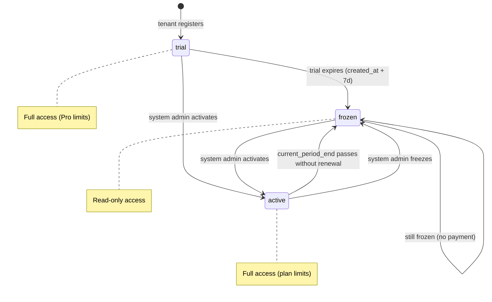

# Plan: Tenant Subscription Module

## Summary

Implements the subscription infrastructure for Korte: 7-day trial enforcement, read-only freeze for expired/unpaid tenants, Basic/Pro plan limits (courts, staff, sports, admins), a Statement of Account page with QR PH payment instructions for tenant admins, and an admin panel notifications view for system admins to manage subscriptions manually. No payment gateway integration at launch — system admin activates tenants after receiving manual payment.

---

## Problem Frame

Tenants currently have unrestricted access indefinitely. The `freeTrialDays: 7` field exists but is never enforced. With launch approaching, the platform needs trial expiration, subscription state enforcement, and a billing workflow — even if payment processing is manual at first. (see origin: `docs/brainstorms/2026-05-04-tenant-subscription-requirements.md`)

---

## Requirements

- R1. Every new tenant starts with a 7-day free trial with full platform access, beginning at `created_at`
- R2. A persistent warning banner appears for all tenant users starting 3 days before trial expiration, showing remaining days
- R3. The warning banner includes an "Upgrade" action visible only to tenant admins; staff see warning text only
- R4. When a trial expires or a subscription lapses, the tenant enters a frozen state
- R5. Frozen tenants have read-only access — can view all data but cannot create, edit, or delete records
- R6. Frozen tenants see a persistent banner; tenant admins see "View billing" linking to Statement of Account; staff see "Contact your admin"
- R7. Freeze is enforced at the API layer — write operations return an error for frozen tenants
- R8. Two plan tiers: Basic (1 sport, 5 courts, 1 admin, 3 staff) / Pro (3 sports, 20 courts, 3 admins, 9 staff)
- R9. Plan limit violations are blocked with a message explaining the limit and prompting upgrade (admins) or contact-admin (staff)
- R10. Pro ceiling message references Max tier: "Need more? Contact us for a custom plan."
- R11. Tenant admins can access a Statement of Account page showing plan, status, due date, amount, and QR PH payment instructions
- R12. Statement of Account shows plan options (Basic ₱499/mo, Pro ₱999/mo) with QR PH code for frozen tenants
- R13. Payment instructions include QR PH code image and note to contact Korte after payment
- R14. System admins can set subscription status (active, frozen, trial), plan tier, and billing period from admin panel
- R15. Admin panel shows in-app notifications for tenants needing attention (expiring trials, overdue subscriptions)
- R16. System admins can activate a subscription with a single action from tenant detail view
- R17. Billing cycle is monthly; `current_period_end` advances by 1 month on renewal

**Origin actors:** A1 (Tenant Admin), A2 (Tenant Staff), A3 (System Admin)
**Origin flows:** F1 (Trial lifecycle), F2 (Manual upgrade), F3 (Monthly billing cycle), F4 (System admin override)
**Origin acceptance examples:** AE1 (R1, R4, R5), AE2 (R2, R3), AE3 (R5, R7), AE4 (R9, R10), AE5 (R14, R16), AE6 (R8, R9), AE7 (R11, R12, R13), AE8 (R15)

---

## Scope Boundaries

- No automated payment gateway (PayMongo/Maya) at launch — planned as follow-up
- No email or SMS notifications — in-app only
- No annual billing — monthly only
- No feature-based tier differentiation — quantity limits only
- No coupon or discount codes
- No Max tier self-service purchase — contact-us only
- No free-tier — trial converts to paid or frozen

### Deferred to Follow-Up Work

- PayMongo/Maya automated billing integration — separate initiative after manual billing validates pricing
- Email/SMS notifications for trial expiry and payment reminders
- Metered Max tier billing (per-court/staff/sport overage)

---

## Context & Research

### Relevant Code and Patterns

- **Middleware** (`src/middleware.ts`): Intercepts all `/api/*` routes, verifies JWT, injects `x-user-id`/`x-tenant-id`/`x-user-role` headers. Freeze check slots in after JWT verification. `PUBLIC_PATHS` array controls which routes skip auth.
- **API route pattern**: Every route uses `getSessionFromHeaders(req)` → `validateBody(Schema, body)` → `db*` function → `ok(data)` / `badRequest()` / `serverError()`. All write operations pass `session.tenantId`.
- **DB layer** (`src/lib/db.ts`): Pure functions accepting `SupabaseClient` + typed params. `toTenant()` mapper converts snake_case DB rows to camelCase app objects. `dbHydrateTenant()` bulk-loads all tenant data via `Promise.all`.
- **Store** (`src/store/index.ts`): Single Zustand store persisted to sessionStorage. `hydrateFromRemote()` sets all data from `/api/hydrate`. `refreshFromServer()` auto-refreshes every 5 minutes.
- **AppShell** (`src/components/app-shell.tsx`): Desktop sidebar + mobile header/bottom nav. Conditional rendering for online/offline status — same pattern for subscription banners.
- **Types** (`src/lib/types.ts`): `Tenant` interface, `UserRole` union type. Enums match PostgreSQL custom types.
- **API response helpers** (`src/lib/api-response.ts`): Envelope `{ data, error: { code, message } }`. Helpers: `ok()`, `created()`, `badRequest()`, `forbidden()`, `serverError()`.
- **Validation** (`src/lib/validation.ts`): Zod schemas per operation. `validateBody()` helper returns typed data or error string.
- **Admin panel** (`src/app/admin/page.tsx`): Existing tenant list with edit capabilities.

### External References

- Stripe does not support PH-registered businesses — ruled out as payment processor
- PayMongo and Maya lack managed subscription billing — would require building recurring charge infrastructure
- QR PH is the universal QR payment standard in the Philippines (GCash, Maya, bank apps)

---

## Key Technical Decisions

- **Per-request DB query for freeze check over JWT-encoded status**: Adding subscription status to the JWT would require reissuing tokens on every status change (admin activation, trial expiry). A single-column DB lookup by tenant ID per request is simpler and instantly reflects status changes. The query is lightweight (indexed primary key lookup) and the middleware already does async work (JWT verification).

- **Hardcoded plan limit constants over database config**: Plan limits (Basic: 1/5/1/3, Pro: 3/20/3/9) are stored as a config object in `src/lib/subscription.ts`. No DB round-trips, trivially changeable, and there's no per-tenant override requirement at launch. If dynamic limits are needed later, the config can be replaced with a DB lookup without changing the enforcement API.

- **Trial tenants operate under Pro limits**: The brainstorm promises "full platform access" during trial (R1). Pro limits (3 sports, 20 courts, 3 admins, 9 staff) represent "full" without being unbounded. This prevents trial users from creating setups that exceed even Pro limits, simplifying the conversion path.

- **Downgrade preserves existing data, blocks new creation**: When a Pro tenant downgrades to Basic and exceeds Basic limits, existing resources remain functional but new creation is blocked until under the limit. No data deletion — avoids cascade issues with bookings and reduces churn from perceived data loss.

- **`TENANT_FROZEN` and `PLAN_LIMIT_EXCEEDED` error codes**: The existing response envelope supports typed error codes. The client can distinguish frozen-state errors from role-based `FORBIDDEN` errors and show appropriate UI (upgrade banner vs generic permission denial).

- **Freeze-exempt routes using prefix matching**: `/api/auth/` (login/logout/register), `/api/hydrate` (exact match, read-only), `/api/billing/` (Statement of Account data). Unlike the existing `PUBLIC_PATHS` which uses exact matching, freeze-exempt routes use prefix matching (`pathname.startsWith()`) to cover current and future sub-routes without enumeration. All other POST/PATCH/DELETE routes are blocked for frozen tenants. GET requests always pass through.

- **Stateless middleware — no DB writes in freeze check**: The middleware reads subscription status and compares dates but never mutates the `subscription_status` column. Expired trials and lapsed subscriptions are treated as frozen for enforcement based on date comparison alone. DB status reconciliation is the admin panel's responsibility (or a future background job). This avoids race conditions on concurrent requests and keeps the middleware purely an enforcement gate.

- **Middleware injects `x-plan-tier` header**: The freeze check query already fetches `plan_tier` — inject it as a request header so downstream route handlers (U4) can read it without a separate DB lookup.

- **`admin_override` flag on tenants**: When true, freeze logic is skipped — the tenant remains in whatever status the system admin set, regardless of trial/billing state. Active overrides are surfaced in the admin panel notifications (U7) so they remain visible and don't get forgotten.

---

## Open Questions

### Resolved During Planning

- **Middleware freeze check structure**: Single middleware guard that checks HTTP method (GET passes, POST/PATCH/DELETE blocked for frozen tenants) after JWT verification. Centralized in middleware rather than per-route to prevent enforcement gaps.
- **Plan limit storage**: Hardcoded constants in a config file — simplest approach, no DB dependency, matches the static nature of the two tiers at launch.
- **Trial expiration calculation**: `created_at + 7 days` exactly (168 hours). Simpler than end-of-calendar-day, no timezone dependency. The `freeTrialDays` field on tenants is used in the calculation, allowing system admin to override per-tenant if needed.
- **Realtime subscriptions for frozen tenants**: Not paused. Realtime is read-only (booking updates) and aligns with the "read-only access" requirement. Only write operations are blocked.

### Deferred to Implementation

- **Exact QR PH image format and dimensions**: System admin provides the image. Implementation should support standard image formats (PNG, JPG, SVG) at a reasonable display size.
- **Admin notification refresh interval**: How frequently the admin panel polls for updated tenant status counts. The existing 5-minute store refresh may be sufficient, or admin panel may use its own polling.

---

## High-Level Technical Design

> *This illustrates the intended approach and is directional guidance for review, not implementation specification. The implementing agent should treat it as context, not code to reproduce.*



**Middleware freeze check flow (read-only — no DB writes):**
```
Request → JWT verify → extract tenantId
  → if route is freeze-exempt (prefix match): pass through
  → if HTTP method is GET: pass through
  → lookup tenant subscription_status, trial_ends_at, current_period_end, plan_tier, admin_override by tenantId
  → if admin_override is true: pass through
  → if status is 'frozen': return 403 TENANT_FROZEN
  → if status is 'trial' and trial_ends_at < now: return 403 TENANT_FROZEN (treat as frozen without writing)
  → if status is 'active' and current_period_end < now: return 403 TENANT_FROZEN (treat as lapsed)
  → inject x-plan-tier header for downstream route handlers
  → pass through
```

The middleware never mutates subscription_status — it treats expired trials and lapsed subscriptions as frozen for enforcement purposes based on date comparison. DB status reconciliation (setting status to 'frozen') happens via the admin panel or a future background job. This keeps the middleware stateless and avoids race conditions on concurrent writes.

---

## Implementation Units

- U1. **Database schema and type updates**

  **Goal:** Add subscription columns to tenants table and update TypeScript types.

  **Requirements:** R1, R4, R8, R14, R17

  **Dependencies:** None

  **Files:**
  - Modify: `supabase/schema.sql`
  - Modify: `src/lib/types.ts`
  - Modify: `src/lib/db.ts`
  - Modify: `src/store/index.ts` (subscription fields flow through existing `hydrateFromRemote`)
  - Modify: `src/app/api/auth/register/route.ts` (set trial status on creation, enforce Pro limits on initial sports/courts)

  **Approach:**
  - Add columns to `tenants` table: `subscription_status` (TEXT NOT NULL DEFAULT 'trial', check constraint: trial/active/frozen), `plan_tier` (TEXT, check constraint: basic/pro/null), `trial_ends_at` (TIMESTAMPTZ), `current_period_end` (TIMESTAMPTZ), `admin_override` (BOOLEAN NOT NULL DEFAULT false)
  - Add PostgreSQL enum or check constraint for `subscription_status` and `plan_tier`
  - Update `Tenant` interface in types.ts with new fields: `subscriptionStatus`, `planTier`, `trialEndsAt`, `currentPeriodEnd`, `adminOverride`
  - Add new union types: `SubscriptionStatus = 'trial' | 'active' | 'frozen'` and `PlanTier = 'basic' | 'pro'`
  - Update `toTenant()` mapper in db.ts to include new fields
  - Update `dbCreateTenant()` to set `subscription_status = 'trial'` and compute `trial_ends_at = created_at + freeTrialDays`
  - Update `dbUpdateTenant()` to support new fields
  - The store's `hydrateFromRemote` already spreads the full tenant object — new fields flow through automatically. No store schema change needed beyond what the `Tenant` type update provides.
  - Update the register route to validate that initial sports/courts counts don't exceed Pro limits (trial operates under Pro limits). The register route creates resources in a loop from user input — without this check, a registration payload could bypass plan limits entirely since it's a public, freeze-exempt route.

  **Patterns to follow:**
  - Existing column addition pattern in `supabase/schema.sql` (check constraints, defaults)
  - Existing `toTenant()` mapper in `src/lib/db.ts`
  - Existing union types like `UserRole`, `BookingStatus` in `src/lib/types.ts`

  **Test scenarios:**
  - Happy path: New tenant created via `dbCreateTenant` has `subscriptionStatus = 'trial'`, `trialEndsAt` set to 7 days from now, `planTier = null`, `adminOverride = false`
  - Happy path: `toTenant()` correctly maps all new snake_case DB columns to camelCase properties
  - Happy path: `/api/hydrate` response includes `subscriptionStatus`, `planTier`, `trialEndsAt`, and `currentPeriodEnd` on the tenant object
  - Edge case: `dbUpdateTenant()` can update `subscriptionStatus` and `planTier` independently without affecting other fields
  - Edge case: Registration with 4 sports (exceeds Pro limit of 3) is rejected or truncated
  - Edge case: Registration with 21 courts (exceeds Pro limit of 20) is rejected or truncated

  **Verification:**
  - Tenant creation includes subscription fields with correct defaults
  - Hydrate endpoint returns subscription fields to the client
  - Registration respects Pro limits on initial resource creation
  - Existing functionality (booking, courts, etc.) is unaffected

---

- U2. **Plan limits config and enforcement helpers**

  **Goal:** Create subscription config with plan limits and helper functions for checking limits.

  **Requirements:** R8, R9, R10

  **Dependencies:** U1

  **Files:**
  - Create: `src/lib/subscription.ts`
  - Modify: `src/lib/api-response.ts`

  **Approach:**
  - Create `src/lib/subscription.ts` with:
    - Plan limits config object: `PLAN_LIMITS` mapping plan tier to limits (sports, courts, admins, staff)
    - Trial limits = Pro limits (per Key Technical Decision)
    - Helper function to check if a resource addition would exceed plan limits, accepting tenant's plan tier and current counts
    - Centralized `enforceResourceLimit(sb, tenantId, planTier, resourceType)` helper that encapsulates: count query → limit check → error response in one call. Returns either `null` (proceed) or a `NextResponse` (limit exceeded). Each route handler calls this with a single line instead of duplicating the 4-step check pattern.
    - Helper function to compute trial status (days remaining, is expired, is in warning period)
    - Plan pricing constants: Basic ₱499/mo, Pro ₱999/mo
  - Add `planLimitExceeded()` response helper to `api-response.ts` returning 403 with code `PLAN_LIMIT_EXCEEDED` and a message including the limit, current plan, and upgrade prompt
  - Add `tenantFrozen()` response helper returning 403 with code `TENANT_FROZEN`

  **Patterns to follow:**
  - Existing response helpers in `src/lib/api-response.ts` (`forbidden()`, `badRequest()`)
  - Constants pattern used for `PRESET_SPORTS` in `src/lib/types.ts`

  **Test scenarios:**
  - Happy path: Basic plan limit check returns false for 4th court (limit 5), true for 6th court
  - Happy path: Pro plan limit check returns false for 19th court (limit 20), true for 21st
  - Happy path: Trial tenant uses Pro limits
  - Edge case: Null plan tier (trial) uses Pro limits
  - Happy path: `getTrialStatus()` returns correct days remaining for a tenant registered 5 days ago (2 days left)
  - Edge case: `getTrialStatus()` returns expired=true for tenant registered 8 days ago
  - Happy path: `planLimitExceeded()` response includes the specific limit name and plan tier in the message
  - Covers AE4. Pro tenant at court limit gets Max tier contact message

  **Verification:**
  - Plan limits correctly gate resource creation for each tier
  - Trial status computation handles edge cases (exact expiration moment, 0 days remaining)

---

- U3. **Middleware freeze enforcement**

  **Goal:** Block write operations for frozen and lapsed tenants at the API layer. Inject plan tier header for downstream route handlers.

  **Requirements:** R4, R5, R7

  **Dependencies:** U1, U2

  **Files:**
  - Modify: `src/middleware.ts`
  - Create: `src/lib/db-subscription.ts` (new file — `db.ts` already exceeds 500-line limit at 702 lines; subscription DB functions go here)

  **Approach:**
  - Create `src/lib/db-subscription.ts` with `dbGetTenantSubscriptionStatus(sb, tenantId)` returning `subscriptionStatus`, `trialEndsAt`, `currentPeriodEnd`, `planTier`, `adminOverride` — all data needed for both freeze check and plan tier injection
  - In middleware, after JWT verification and before header injection:
    1. If route is freeze-exempt (prefix match: `pathname.startsWith('/api/auth/')`, `pathname === '/api/hydrate'`, `pathname.startsWith('/api/billing/')`), skip check
    2. If HTTP method is GET, skip check
    3. Query tenant subscription status via `dbGetTenantSubscriptionStatus`
    4. If `adminOverride` is true, skip freeze check (still inject plan tier header)
    5. If status is `frozen`: return 403 `TENANT_FROZEN`
    6. If status is `trial` and `trialEndsAt < now`: return 403 `TENANT_FROZEN` (treat as frozen, no DB write)
    7. If status is `active` and `currentPeriodEnd < now`: return 403 `TENANT_FROZEN` (billing lapsed, no DB write)
    8. Inject `x-plan-tier` header from the query result
    9. Proceed
  - The middleware never writes to the DB — it treats expired/lapsed tenants as frozen based on date comparison alone. DB status reconciliation happens via admin panel actions.
  - Freeze-exempt routes use prefix matching (`startsWith`) rather than exact matching, unlike existing `PUBLIC_PATHS`. This covers current and future sub-routes.

  **Execution note:** Start with a focused test for the freeze check logic — verify that GET passes, POST is blocked, exempt routes pass, admin override bypasses, and both trial expiry and billing lapse are caught.

  **Patterns to follow:**
  - Existing middleware auth check pattern (JWT verification → conditional pass/reject)
  - Existing `PUBLIC_PATHS` constant for route exemption (but use prefix matching for freeze-exempt)

  **Test scenarios:**
  - Covers AE1. Frozen tenant: GET `/api/hydrate` succeeds, POST `/api/bookings` returns 403 `TENANT_FROZEN`
  - Covers AE3. Frozen tenant: direct POST to `/api/bookings` returns 403 with `TENANT_FROZEN` code even with valid JWT
  - Happy path: Active tenant with valid `currentPeriodEnd` can POST to any write endpoint
  - Happy path: Trial tenant within 7 days can POST to any write endpoint
  - Happy path: Trial tenant past 7 days returns 403 `TENANT_FROZEN` (without DB status change)
  - Happy path: Active tenant past `currentPeriodEnd` returns 403 `TENANT_FROZEN` (billing lapsed)
  - Happy path: Freeze-exempt routes (`/api/auth/login`, `/api/auth/logout`, `/api/hydrate`, `/api/billing/account`) pass for frozen tenants
  - Happy path: Admin-override tenant bypasses freeze check regardless of status
  - Happy path: `x-plan-tier` header is injected for non-frozen requests
  - Edge case: GET requests always pass regardless of tenant status
  - Edge case: Admin-override tenant with expired trial still has `x-plan-tier` injected

  **Verification:**
  - No write operation succeeds for a frozen, trial-expired, or billing-lapsed tenant (except freeze-exempt routes)
  - All read operations continue to work regardless of tenant status
  - Downstream route handlers can read plan tier from `x-plan-tier` header without a separate DB query

---

- U4. **Plan limit enforcement in write API routes**

  **Goal:** Check plan limits before creating courts, sports, staff, and admin users.

  **Requirements:** R8, R9, R10

  **Dependencies:** U1, U2

  **Files:**
  - Modify: `src/app/api/courts/route.ts`
  - Modify: `src/app/api/sports/route.ts`
  - Modify: `src/app/api/users/route.ts`

  **Approach:**
  - In each POST handler, before the db insert, call the centralized `enforceResourceLimit(sb, tenantId, planTier, resourceType)` helper from U2. This encapsulates count query, limit check, and error response — each route adds a single call.
  - Read `planTier` from the `x-plan-tier` header injected by middleware (U3), avoiding a separate DB lookup.
  - For users route: differentiate between admin and staff counts separately against their respective limits
  - For Pro ceiling: the helper includes Max tier contact message (R10)

  **Patterns to follow:**
  - Existing role check pattern in `src/app/api/users/route.ts` (checks role before allowing creation)
  - Existing count queries in db.ts

  **Test scenarios:**
  - Covers AE6. Basic tenant with 3 staff: adding 4th staff returns `PLAN_LIMIT_EXCEEDED` with Basic limit message and upgrade prompt
  - Covers AE4. Pro tenant with 20 courts: adding 21st court returns `PLAN_LIMIT_EXCEEDED` with Max tier contact message
  - Happy path: Basic tenant with 4 courts: adding 5th court succeeds (at limit, not over)
  - Happy path: Pro tenant with 2 sports: adding 3rd sport succeeds
  - Edge case: Basic tenant with 1 admin: adding another admin user returns limit error (admin limit is 1)
  - Edge case: Trial tenant (Pro limits) with 19 courts: adding 20th succeeds, adding 21st fails

  **Verification:**
  - Every resource type (courts, sports, admin users, staff users) is gated by plan limits
  - Limit messages correctly identify the plan tier and suggest the appropriate upgrade path

---

- U5. **Subscription banner in AppShell**

  **Goal:** Show persistent warning and frozen-state banners to all tenant users.

  **Requirements:** R2, R3, R6

  **Dependencies:** U1

  **Files:**
  - Modify: `src/components/app-shell.tsx`
  - Modify: `src/store/index.ts`

  **Approach:**
  - Add derived state to the store or compute in AppShell: `subscriptionStatus`, `trialDaysRemaining`, `isFrozen`, `isTrialWarning` — derived from `tenant.subscriptionStatus`, `tenant.trialEndsAt`
  - In AppShell, render a banner component conditionally:
    - **Trial warning** (3 days or fewer remaining): amber/warning banner with "Your trial ends in X days" text. Tenant admins see an "Upgrade" link to `/billing`. Staff see warning text only.
    - **Frozen**: red/urgent banner. Tenant admins see "Your account is frozen — View billing" linking to `/billing`. Staff see "Your account is frozen — contact your admin."
  - Banner renders above `{children}` inside the content area, after `<MobileHeader />`
  - Banner is sticky/persistent — does not dismiss

  **Patterns to follow:**
  - Existing online/offline conditional rendering in AppShell sidebar and mobile header
  - Existing role-based conditional rendering (`currentUser.role` checks) for nav items

  **Test scenarios:**
  - Covers AE2. Trial tenant with 2 days remaining: staff sees warning text without upgrade link; admin sees warning with "Upgrade" link to `/billing`
  - Happy path: Active paid tenant sees no banner
  - Happy path: Trial tenant with 5 days remaining (outside warning window) sees no banner
  - Happy path: Frozen tenant admin sees frozen banner with "View billing" link
  - Happy path: Frozen tenant staff sees frozen banner with "Contact your admin" message
  - Edge case: Trial tenant with exactly 3 days remaining sees the warning banner
  - Edge case: Trial tenant with 0 days remaining (expires today) sees "Trial expires today" message

  **Verification:**
  - Banners appear on every page (wrapped by AppShell)
  - Banner content and actions are role-appropriate
  - No banner appears for active paid tenants or tenants in early trial

---

- U6. **Statement of Account page**

  **Goal:** Provide tenant admins with billing status, plan options, pricing, and QR PH payment instructions.

  **Requirements:** R11, R12, R13

  **Dependencies:** U1, U2

  **Files:**
  - Create: `src/app/billing/page.tsx`
  - Create: `src/app/api/billing/account/route.ts`
  - Modify: `src/lib/api.ts` (add `apiBillingAccount` client function)
  - Add: `public/qr-ph.png` (placeholder — system admin provides actual QR image)

  **Approach:**
  - **API route** (`/api/billing/account`): GET endpoint returning tenant subscription status, plan tier, trial days remaining, current period end, plan options with pricing. Accessible only to `tenant_admin` role. This route is freeze-exempt.
  - **Page** (`/billing`): Client page showing:
    - Current plan and status (trial / active / frozen)
    - If trial: days remaining, trial end date
    - If active: next billing date, amount due
    - If frozen: urgency messaging ("Your account is frozen")
    - Plan comparison card: Basic (₱499/mo) vs Pro (₱999/mo) with limits listed
    - QR PH code image with payment instructions ("Pay via GCash, Maya, or any QR PH-enabled bank app")
    - Note: "After payment, contact Korte to activate your subscription"
  - Page accessible only to `tenant_admin` — redirect staff to dashboard with a toast message
  - Add navigation link in AppShell for tenant admins (under Settings or as a standalone nav item)

  **Patterns to follow:**
  - Existing page layout in `src/app/settings/page.tsx` (Section component, card-based UI)
  - Existing API route pattern with session extraction and role check
  - Existing `apiHydrate` pattern in `src/lib/api.ts` for client API functions

  **Test scenarios:**
  - Covers AE7. Frozen tenant admin navigates to `/billing`: sees plan options with pricing, QR PH code, and activation instructions
  - Happy path: Active tenant admin sees current plan, next billing date, and amount due
  - Happy path: Trial tenant admin sees days remaining and plan options for when trial ends
  - Happy path: Staff user attempting to access `/billing` is redirected to dashboard
  - Error path: Unauthenticated request to `/api/billing/account` returns 401

  **Verification:**
  - Tenant admins can find and understand payment instructions without external help
  - Plan comparison clearly shows what each tier includes
  - QR PH code is displayed at a scannable size

---

- U7. **Admin panel subscription management**

  **Goal:** Enable system admins to view tenant subscription status and manually activate/freeze subscriptions.

  **Requirements:** R14, R15, R16

  **Dependencies:** U1

  **Files:**
  - Modify: `src/app/admin/page.tsx`
  - Modify: `src/app/api/admin/tenants/route.ts`
  - Modify: `src/app/api/admin/tenants/[tenantId]/route.ts`
  - Modify: `src/lib/validation.ts` (update `AdminUpdateTenantSchema`)
  - Modify: `src/lib/db-subscription.ts` (add `dbGetTenantsNeedingAttention` query — same new file created in U3)

  **Approach:**
  - **Notifications section** at the top of admin panel: Shows counts and list of tenants needing attention — trials expiring within 3 days, expired trials, overdue subscriptions (past `current_period_end`), and tenants with active `admin_override` flags (to prevent forgotten overrides). Uses a dedicated DB query that filters by status/dates/flags.
  - **Tenant list enhancement**: Add `subscriptionStatus` and `planTier` columns to the existing tenant list. Color-coded status badges (green=active, amber=trial, red=frozen).
  - **Tenant detail actions**: Add subscription management controls to the existing tenant edit view:
    - Set status (active, frozen, trial)
    - Set plan tier (basic, pro)
    - Set `currentPeriodEnd` (date picker, defaults to +1 month from today)
    - Toggle `adminOverride`
    - "Activate subscription" quick action: sets status=active, prompts for plan tier, sets `currentPeriodEnd` to +1 month
  - Update `AdminUpdateTenantSchema` in validation.ts to accept new subscription fields
  - Update the PATCH handler in `[tenantId]/route.ts` to process subscription field updates

  **Patterns to follow:**
  - Existing admin panel tenant list and edit UI in `src/app/admin/page.tsx`
  - Existing `AdminUpdateTenantSchema` pattern in `src/lib/validation.ts`
  - Existing PATCH handler in `src/app/api/admin/tenants/[tenantId]/route.ts`

  **Test scenarios:**
  - Covers AE5. System admin sets frozen tenant to active with Pro plan: tenant is immediately unfrozen
  - Covers AE8. Admin panel shows notifications for 2 tenants with expiring trials and 1 overdue tenant
  - Happy path: System admin activates a subscription — status changes to active, plan tier is set, `currentPeriodEnd` is 1 month from now
  - Happy path: System admin freezes an active tenant — status changes to frozen
  - Happy path: System admin sets `adminOverride` = true — tenant bypasses freeze logic
  - Happy path: System admin clears `adminOverride` — normal lifecycle resumes
  - Edge case: System admin extends trial by updating `trialEndsAt` to a future date
  - Edge case: System admin downgrades Pro tenant with 15 courts to Basic — downgrade succeeds, existing courts remain, new court creation is blocked by plan limits (U4)
  - Happy path: Admin notifications include tenants with active `admin_override` flags

  **Verification:**
  - System admin can activate a tenant within 30 seconds of confirming payment
  - Notifications accurately reflect tenant states
  - Override flag correctly bypasses freeze enforcement (verified via API calls)

---

- U8. **Client-side freeze UX enforcement**

  **Goal:** Disable write actions in the UI for frozen tenants as a complementary UX layer to API enforcement.

  **Requirements:** R5, R6

  **Dependencies:** U1, U3, U5

  **Files:**
  - Modify: `src/store/index.ts`

  **Approach:**
  - Add a derived `isFrozen` computed value to the store based on `tenant.subscriptionStatus` and date comparisons (same logic as middleware — check `trialEndsAt` and `currentPeriodEnd`)
  - Add a centralized freeze guard inside the store's write actions (`createBooking`, `addCourt`, `addSport`, `addMember`, `createUser`, `addItem`, etc.). When `isFrozen` is true, the action shows a role-appropriate toast and returns early before calling the API:
    - Tenant admins see: "Your account is frozen — upgrade your plan" with a link to `/billing`
    - Staff see: "Your account is frozen — contact your admin"
  - This approach covers all current and future pages automatically since all writes go through store actions. No per-page modifications needed — new pages inherit freeze protection without remembering to add checks.
  - This is a UX enhancement — API enforcement (U3) is the authoritative gate. The client-side check prevents users from filling out forms only to get an error on submit.

  **Patterns to follow:**
  - Existing role-based conditional rendering throughout the app
  - Existing toast pattern in `src/components/toast.tsx`

  **Test scenarios:**
  - Happy path: Frozen tenant admin clicks "New Booking" — sees a prompt directing to `/billing` instead of the booking form
  - Happy path: Frozen tenant staff clicks "New Booking" — sees "Contact your admin" message
  - Happy path: Active tenant sees all action buttons enabled as normal
  - Integration: Frozen tenant bypasses client UI (direct API call) — still blocked by middleware (U3)

  **Verification:**
  - No write action buttons are active for frozen tenants
  - Appropriate messaging shown based on user role
  - Active and trial tenants see no UI degradation

---

## System-Wide Impact

- **Interaction graph:** Middleware is the central enforcement point — every API route is affected by the freeze check. The Zustand store propagates subscription state to all client pages via `hydrateFromRemote`. AppShell banner renders on every page. Plan limits affect POST handlers for courts, sports, users, and items.
- **Error propagation:** Frozen-state errors (403 `TENANT_FROZEN`) and plan limit errors (403 `PLAN_LIMIT_EXCEEDED`) propagate from middleware/API → client API wrapper → store action catch → toast/banner UI. The client must handle these specific error codes distinctly from generic 403 (role-based).
- **State lifecycle risks:** The middleware is stateless — it enforces freeze based on date comparisons without mutating DB status. This means `subscription_status` in the DB can be stale (e.g., still 'trial' after expiry). The banner computation and middleware both use date comparison independently of DB status, so enforcement is correct. DB status reconciliation happens via admin panel actions. Any external system or report querying `subscription_status` directly should use the date fields (`trial_ends_at`, `current_period_end`) for accuracy.
- **Items and members are intentionally unlimited:** Plan limits gate sports, courts, admin users, and staff accounts only. Items (rentals/sales) and members have no plan-tier caps — they are tied to the facility's operations and limiting them would degrade the booking experience without meaningful upgrade pressure.
- **API surface parity:** All write endpoints are uniformly affected by freeze enforcement in middleware — no per-route opt-in required. New API routes added in the future automatically inherit freeze checking unless explicitly added to the exempt list.
- **Unchanged invariants:** Existing auth flow (JWT, session cookies, role-based access) is unchanged. Existing RBAC (tenant_admin vs tenant_staff nav items) is unchanged. Existing data models (bookings, courts, members, etc.) are unchanged — only the tenant model gains new fields.

---

## Risks & Dependencies

| Risk | Mitigation |
|------|------------|
| Per-request DB query for freeze check adds latency to every write request | Query is a single-column indexed lookup by primary key — sub-millisecond. Monitor and add in-memory caching (30s TTL by tenantId) if latency becomes measurable. |
| Lazy trial-to-frozen transition could leave stale "trial" status in DB | Banner computation uses date comparison independently of DB status. First write attempt triggers the update. Alternatively, add a periodic cleanup job later. |
| QR PH image is a static asset — if payment details change, requires redeployment | Accept this for launch. Future: make QR image configurable via admin panel (upload to Supabase storage). |
| Manual billing doesn't scale beyond ~50 tenants | This is intentional — manual billing validates pricing before investing in gateway automation. PayMongo/Maya integration is the planned follow-up. |
| Downgrade with over-limit data creates an awkward UX (features visible but can't add more) | Clear messaging explains the limit and suggests upgrading. Existing data remains functional — no silent breakage. |

---

## Sources & References

- **Origin document:** [docs/brainstorms/2026-05-04-tenant-subscription-requirements.md](docs/brainstorms/2026-05-04-tenant-subscription-requirements.md)
- Middleware: `src/middleware.ts`
- API response helpers: `src/lib/api-response.ts`
- Database layer: `src/lib/db.ts`
- Types: `src/lib/types.ts`
- Store: `src/store/index.ts`
- AppShell: `src/components/app-shell.tsx`
- Admin panel: `src/app/admin/page.tsx`
- Schema: `supabase/schema.sql`
